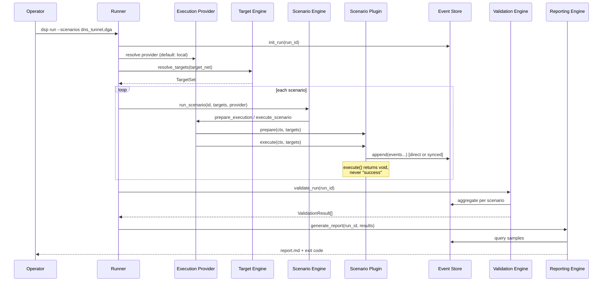

# Detection Scenario Platform — Architecture Specification

**문서 버전:** 0.3.0 (Execution Provider Architecture)  
**상태:** Design only — no implementation

---

## 1. Overview

DSP는 권한 있는 PoC 환경에서 탐지 시나리오를 **실행·기록·검증·리포트**하는 플랫폼이다. 모든 판정은 Event Store를 유일한 진실원(SOT)으로 사용한다.

### 1.1 설계 목표

| ID | 목표 |
|----|------|
| G1 | Execution = Validation = Reporting (단일 경로) |
| G2 | 시나리오 플러그인으로 확장, 코어 수정 최소화 |
| G3 | Traffic 생성과 Detection 확인 분리 |
| G4 | 3년간 vendor·시나리오 확장 가능 |
| G5 | Safe PoC — lab subnet, volume cap, no malware |
| G6 | Execution location abstracted — Mode A (local) and Mode B (remote) without scenario changes |

### 1.2 Execution Models

DSP는 두 실행 모드를 공식 지원한다. 상세: [docs/architecture/EXECUTION_MODEL_SPEC.md](./docs/architecture/EXECUTION_MODEL_SPEC.md)

| Mode | Name | Traffic origin | Default |
|------|------|----------------|---------|
| **A** | Local Execution | DSP Host | Yes (`LocalExecutionProvider`) |
| **B** | Remote Execution | Remote host (webshell, agent, SSH, …) | Opt-in via Execution Provider |

**설계 규칙:** 시나리오는 execution-agnostic. 실행 위치는 **Execution Provider**가 결정한다 (ADR 0006).

---

## 2. Component Map

```
                    ┌──────────────┐
                    │    Runner    │  CLI: dsp run / validate / report
                    └──────┬───────┘
                           │
         ┌─────────────────┼─────────────────┐
         ▼                 ▼                 ▼
┌────────────────┐ ┌────────────┐ ┌──────────────┐
│  Execution     │ │  Scenario  │ │    Plugin    │
│  Provider      │ │   Engine   │ │    Loader    │
│  Registry      │ └─────┬──────┘ └──────┬───────┘
│  local│remote  │       │               │
└───────┬────────┘       │               │
        │         ┌──────┴──────┐        │
        │         ▼             ▼        │
        │  ┌────────────┐  ScenarioRegistry
        │  │   Target   │  (auto-discover)
        │  │   Engine   │
        │  └─────┬──────┘
        │        │ TargetSet (CIDR-safe)
        ▼        ▼
     ┌─────────────────────────────────────┐
     │         Scenario Plugins            │
     │  dns_tunnel │ dga │ http │ ssh │ sql │
     │  (execution-agnostic protocol logic)  │
     └─────────────────┬───────────────────┘
                       │ append events (local or synced)
                       ▼
              ┌─────────────────┐
              │   Event Store   │  ← SINGLE SOURCE OF TRUTH
              │  (SQLite/JSONL) │
              └────────┬────────┘
                       │
           ┌───────────┴───────────┐
           ▼                       ▼
    ┌──────────────┐       ┌──────────────┐
    │  Validation  │       │  Reporting   │
    │    Engine    │       │    Engine    │
    └──────┬───────┘       └──────┬───────┘
           │                      │
           └──────────┬───────────┘
                      ▼
              RunResult / Report
                      │
                      ▼ (optional, future)
              ┌──────────────┐
              │  Detection   │
              │   Adapters   │  Stellar / Defender / Splunk …
              └──────────────┘
```

---

## 3. Component Specifications

### 3.1 Runner

**책임:** CLI 진입점, run lifecycle 관리, 구성 로드.

| 명령 | 동작 |
|------|------|
| `dsp run` | 시나리오 실행 → Event Store 기록 → validate → report |
| `dsp validate` | 기존 run_id Event Store만으로 재검증 |
| `dsp report` | 기존 run_id 리포트 재생성 |
| `dsp list-scenarios` | Plugin Loader가 등록한 시나리오 목록 |

**Runner는 하지 않는 것:**

- stdout/grep으로 성공 판정
- 시나리오별 프로토콜 로직 (플러그인에 위임)
- synthetic score 계산

**Run Context (모든 컴포넌트 공유):**

```python
@dataclass
class RunContext:
    run_id: str              # UUID or timestamp slug
    target_net: str          # e.g. "10.10.10.0/24"
    started_at: datetime
    config: RunConfig
    event_store: EventStore  # injected — never recreated mid-run
    dry_run: bool
```

### 3.2 Scenario Engine

**책임:** 등록된 시나리오를 순서·병렬 정책에 따라 실행.

**Lifecycle per scenario:**

```
prepare(ctx, targets) → execute(ctx, targets) → [events appended]
                              ↓
                    ValidationEngine.validate(scenario_id)
                              ↓
                    scenario.summarize(ctx) → ScenarioSummary
```

**실행 정책:**

- 기본: sequential (레거시 overlap 실패 교훈)
- 옵션: `max_parallel_scenarios` (Phase 2+, Event Store write lock 보장)
- fail-fast: Target Engine이 빈 target set 반환 시 skip (실패 아님, `skipped` 상태)

**Scenario Engine은 성공을 선언하지 않는다.** Validation Engine만 `success|partial|failed|skipped` 반환.

### 3.3 Target Engine

**책임:** lab 범위 내 실행 대상 선정·검증.

| 기능 | 설명 |
|------|------|
| CIDR enforcement | `target_net` 밖 IP/URL 거부 |
| Discovery (optional) | port scan, reachability — **preflight only** |
| TargetSet | 시나리오별 필요 타입 (`dns_resolver`, `http_host`, `ssh_host`) |

**레거시 교훈:** Discovery 결과가 0이어도 stage_result Success 금지. Target 없으면 시나리오 `skipped`, Event Store에 `target_unavailable` 이벤트 1건 기록.

```json
{
  "scenario": "http_followup",
  "event": "scenario_skipped",
  "reason": "no_reachable_http_targets",
  "target_net": "10.10.10.0/24"
}
```

### 3.4 Event Store

**책임:** append-only 이벤트 저장, run_id 격리, summary 쿼리 API.

상세: [EVENT_STORE_SPEC.md](./EVENT_STORE_SPEC.md)

**핵심 API (개념):**

```python
class EventStore:
    def append(self, event: Event) -> None: ...
    def query(self, filters: EventQuery) -> list[Event]: ...
    def aggregate(self, spec: AggregateSpec) -> dict[str, int | float]: ...
    def run_event_count(self, run_id: str, scenario: str) -> int: ...
```

### 3.5 Validation Engine

**책임:** Event Store 집계만으로 시나리오·run 판정.

**입력:** `run_id`, `scenario_id` (또는 전체 run)  
**출력:** `ValidationResult(decision, reason, metrics, fail_fast_codes)`

**금지:** stdout, log file grep, overlap env, planned counters

**판정 흐름:**

```
1. EventStore.aggregate(scenario_validation_spec)
2. apply_thresholds(metrics) → decision
3. check_fail_fast_invariants(metrics) → CODE_FAILURE if violated
4. return ValidationResult
```

시나리오별 threshold는 `scenarios/<id>/manifest.yaml`의 `validation` 블록에 선언 (코드 하드코딩 최소화).

### 3.6 Reporting Engine

**책임:** Event Store + ValidationResult → human/machine report.

**입력:** Event Store, ValidationResult[], RunContext  
**출력:** Markdown / JSON report

**금지:**

- stdout 파싱
- synthetic detection score
- stage_result log를 success 근거로 사용

**리포트 섹션:**

1. Run metadata (run_id, target_net, scenarios, duration)
2. Per-scenario validation table (decision, reason, key metrics)
3. Event samples (최대 N건, PII 없음)
4. Fail-fast codes (있을 경우)
5. (Optional) Detection adapter results — 별도 섹션, traffic validation과 분리

### 3.7 Plugin Loader

**책임:** `scenarios/` 디렉터리 스캔, manifest 로드, Scenario 클래스 등록.

**발견 규칙:**

```
scenarios/<scenario_id>/
├── manifest.yaml      # required
├── scenario.py        # Scenario subclass
└── executor.py        # optional: traffic logic
```

`manifest.yaml`의 `id`가 canonical scenario_id. 폴더명과 일치 필수.

### 3.8 Execution Provider Layer

**책임:** 트래픽 **출발 위치**(local vs remote) 및 transport 추상화.

| Provider | Mode | Traffic origin |
|----------|------|----------------|
| `LocalExecutionProvider` | A | DSP Host (default) |
| `WebshellExecutionProvider` | B | Remote via HTTP webshell |
| `AgentExecutionProvider` | B | Remote via agent protocol |
| `SSHExecutionProvider` | B | Remote via SSH |

상세: [EXECUTION_PROVIDER_SPEC.md](./EXECUTION_PROVIDER_SPEC.md), [ADR 0006](./docs/adr/0006-execution-provider-architecture.md)

**Execution Provider는 하지 않는 것:**

- Validation 판정 (Validation Engine only)
- Event schema 변경 (sync 후 동일 schema)
- 시나리오별 protocol 분기 (scenario plugin owns protocol)

**Target Provider vs Execution Provider:**

| Layer | Question |
|-------|----------|
| Target Provider | Where does traffic **go**? |
| Execution Provider | Where does traffic **originate**? |

### 3.9 Detection Model Layer (Overview)

Scenario(트래픽)와 Detection Model(탐지 확인)은 **별도 레이어**. 상세: §17.

---

## 4. Data Flow

### 4.1 End-to-End Run Flow



### 4.2 Exit Code Policy

| Code | 의미 |
|------|------|
| 0 | 모든 requested scenario `success` |
| 1 | 하나 이상 `failed` 또는 `CODE_FAILURE` |
| 2 | partial success (일부 success, 일부 failed/skipped) |
| 3 | configuration / safety violation |

---

## 5. Event Flow

### 5.1 Event Lifecycle

```
[Scenario execute]
    │
    ├─► scenario_started     (status: info)
    ├─► query_sent / request_sent / auth_attempted  (status: sent)
    ├─► query_response / http_response / auth_failed (status: outcome)
    ├─► scenario_error       (status: error)
    └─► scenario_completed   (status: info)
         │
         ▼
    Event Store (append-only)
         │
         ├─► ValidationEngine.aggregate()
         └─► ReportingEngine.sample()
```

### 5.2 Event 작성 규칙

| 규칙 | 설명 |
|------|------|
| E1 | 모든 네트워크 액션은 1 action = 1 event (batch 금지, debug 제외) |
| E2 | `run_id` 필수 — cross-run 오염 방지 |
| E3 | `scenario` + `event` + `status` 삼각형으로 query 가능 |
| E4 | `evidence`는 구조화 문자열 또는 JSON — free text 최소화 |
| E5 | execute() 종료 시 `scenario_completed` 필수 (crash 시 Runner가 `scenario_aborted` 기록) |

### 5.3 레거시 TSV → DSP Event 매핑

| Legacy TSV field | DSP Event field |
|------------------|-----------------|
| `module` | `scenario` |
| `stage` | `stage` |
| `action` | `event` |
| `artifact` | `artifact` |
| `status` | `status` |
| `evidence_value` | `evidence` |
| `target` | `target` |

---

## 6. Validation Flow

### 6.1 Per-Scenario Validation Pipeline

```
EventStore.aggregate(
    run_id=...,
    scenario=...,
    metrics=[sent, nxdomain, responses, ...]
)
    ↓
Threshold check (from manifest.yaml)
    ↓
Fail-fast invariants
    ↓
ValidationResult
```

### 6.2 초기 시나리오 Thresholds (레거시 검증 기반)

| Scenario | Success Condition | Partial | Failed |
|----------|-------------------|---------|--------|
| `dns_tunnel` | `query_sent >= 1` | — | `query_sent == 0` |
| `dga` | `nxdomain >= 300 && resolvable >= 10` && `base_domain == xdr.ooo` | thresholds 50% | no events or wrong base |
| `http_followup` | `attempted >= 1 && responses >= 1` | attempted only | no events |
| `ssh_failure` | `auth_attempted >= 1` | — | no events |
| `sql_injection` | `injection_request_sent >= 1` | — | no events |

**강화 메트릭 (권장, success 추가 조건):**

- DNS Tunnel: `idx_pattern_ratio >= 0.8`, `avg_label_length >= 40`
- DGA: full run `nx >= 500 && resolvable >= 30`

### 6.3 Fail-Fast Invariants

| Code | Condition |
|------|-----------|
| `SOT_EMPTY_AFTER_EXECUTE` | stage executed + event_count=0 |
| `SOT_SENT_WITHOUT_ARTIFACT` | sent>0 + unique_artifact=0 |
| `STDOUT_ONLY_REJECTED` | (test only) stdout claims success, events=0 |
| `COUNTER_IMPOSSIBLE` | responses > attempted |

### 6.4 Validation vs Detection

| | Traffic Validation | Detection Confirmation |
|--|-------------------|----------------------|
| 데이터 소스 | Event Store | Vendor API / SIEM |
| Phase 1 | **필수** | 선택 |
| 리포트 | Primary | Secondary appendix |
| 실패 의미 | 트래픽 미생성 | 센서 미탐지 (환경 이슈 가능) |

---

## 7. Reporting Flow

```
ValidationResult[] + EventStore
    │
    ├─► Executive summary (counts: success/failed/skipped)
    ├─► Scenario table
    │     scenario | decision | reason | query_sent | ...
    ├─► Event samples (top 5 per scenario)
    ├─► Fail-fast section
    └─► Raw JSON appendix (machine-readable)
```

**레거시 실패 방지:** 리포트의 scenario row는 **반드시** ValidationResult에서만 생성. Executor stdout은 "Debug Log" 부록에만 포함 가능.

---

## 8. Plugin Architecture

### 8.1 Discovery & Registration

```python
# Plugin Loader pseudocode
for path in scenarios_dir.iterdir():
    manifest = load_yaml(path / "manifest.yaml")
    module = importlib.import_module(f"scenarios.{path.name}.scenario")
    cls = module.Scenario
    registry.register(manifest.id, cls, manifest)
```

### 8.2 Manifest-Driven Configuration

시나리오별 변수는 manifest에 선언. Runner가 `RunConfig`로 merge.

```yaml
# scenarios/dns_tunnel/manifest.yaml (example)
id: dns_tunnel
version: "1.0.0"
title: DNS Tunnel — idx-pattern UDP/53
targets:
  requires: [dns_resolver]
validation:
  metrics:
    - query_sent
    - idx_pattern_count
    - avg_label_length
  success:
    query_sent: { min: 1 }
    idx_pattern_ratio: { min: 0.8 }
defaults:
  base_domain: dns-tunnel.com
  duration_sec: 180
safety:
  max_queries: 15000
  allowed_domains: [dns-tunnel.com]
```

### 8.3 Core vs Plugin Boundary

| Core (수정 필요) | Plugin (폴더 추가) |
|------------------|-------------------|
| Event Store schema | Protocol executor |
| Validation Engine framework | Threshold values |
| Runner CLI | FQDN/URL generation logic |
| Plugin Loader | MITRE tags, metadata |

---

## 9. Deployment Topology

### 9.1 Execution Mode A — Local Execution (Current)

```
[DSP Host]
  dsp run
    → LocalExecutionProvider
    → scenarios execute locally
    → Event Store: ~/.dsp/runs/<run_id>/events.db
    → Report: ~/.dsp/runs/<run_id>/report.md
```

Phase 1–5 구현·운영 모델. Default provider = `local`.

### 9.2 Execution Mode B — Remote Execution (Architecture)

레거시 webshell bootstrap 패턴을 **Execution Provider**로 격리:

```
[DSP Host — Orchestrator]
  dsp run --execution-provider webshell --remote-target 10.10.10.50
    → WebshellExecutionProvider
    → remote traffic on victim host
    → events sync → local Event Store
    → Validation / Report unchanged
```

| Provider | Transport | Phase (unassigned) |
|----------|-----------|-------------------|
| `webshell` | HTTP webshell | X+1 |
| `agent` | Agent protocol | X+2 |
| `ssh` | SSH remote exec | X+3 |

Remote path도 **동일 Event schema**. sync 후 local Validation Engine이 판정.  
상세: [docs/architecture/EXECUTION_MODEL_SPEC.md](./docs/architecture/EXECUTION_MODEL_SPEC.md)

### 9.3 Future Integration with xdr-lab-appliance (Design Only)

DSP는 `detection-scenario-platform/` 아래 **독립 패키지**로 구현한다.

**Phase 0–2:** 아래 통합은 **설계만** 존재하며 구현하지 않는다.

- `aella_cli` / `appliance_cli.py` 수정 금지
- `bootstrap/`, `installer/`, `scripts/` hook 금지
- deployment automation 파일 import 금지

**Future (Phase 3+, 별도 승인):**

```
aella_cli poc run --engine dsp --scenarios dns_tunnel,dga
        │
        ▼
detection-scenario-platform/dsp/runner
```

기존 `stellar_poc.sh` 및 deployment automation은 DSP Phase 0–2에서 **수정하지 않는다**.  
Workspace boundary: [WORKSPACE_BOUNDARY.md](./WORKSPACE_BOUNDARY.md)

---

## 10. Observability

| Signal | 용도 | SOT? |
|--------|------|------|
| Event Store | validation, reporting | **Yes** |
| Structured log (JSON lines) | debug, audit | No |
| Executor stdout | human progress | No |
| Metrics (Prometheus, future) | ops dashboard | No |

로그에 `run_id`, `scenario`, `event_id` correlation ID 필수.

---

## 11. Security Architecture

```
┌─────────────────────────────────────┐
│         Safety Envelope             │
│  ┌───────────────────────────────┐  │
│  │ Target Engine: CIDR check     │  │
│  ├───────────────────────────────┤  │
│  │ Manifest safety block         │  │
│  ├───────────────────────────────┤  │
│  │ Runner: dry-run mode          │  │
│  ├───────────────────────────────┤  │
│  │ Volume caps per scenario      │  │
│  └───────────────────────────────┘  │
│           Scenario Executor         │
└─────────────────────────────────────┘
```

---

## 12. Testing Architecture

**원칙:** 테스트가 사용하는 `validate()` == 프로덕션이 사용하는 `validate()`

```
tests/
├── unit/
│   ├── test_event_store.py
│   ├── test_validation_engine.py
│   └── test_plugin_loader.py
├── scenarios/
│   ├── test_dns_tunnel_validation.py  # synthetic events → validate
│   └── test_stdout_rejection.py       # 반드시 FAIL
└── integration/
    └── test_run_e2e_dry_run.py      # dry-run → events → report
```

레거시 `test_event_sot_architecture.sh`의 테스트 케이스를 Python pytest로 **동등 이식** (threshold, fail-fast, stdout rejection).

---

## 13. Versioning & Compatibility

| Artifact | Version field |
|----------|---------------|
| Event schema | `event_schema_version` in RunContext |
| Scenario manifest | `manifest.version` |
| Validation spec | `validation.version` |
| Report format | `report_format_version` |

Breaking change 시 migration script 제공. Event Store append-only이므로 old runs는 read-only 보존.

---

## 14. Scalability Review (30–50 Scenarios)

| Concern | Design mitigation | Core change when adding scenario? |
|---------|-------------------|----------------------------------|
| Plugin registration | Folder scan + manifest | **No** |
| Validation thresholds | `manifest.validation` | **No** |
| Event schema | Generic `Event` row | **No** |
| Aggregate metrics | `MetricDef` in manifest | **No** |
| Detection mapping | [DETECTION_CATALOG.md](./DETECTION_CATALOG.md) | **No** |
| Reporting layout | Generic per-scenario row | **No** |
| Shared protocol code | `dsp/protocols/` reuse | Rarely (shared lib only) |

**30–50 시나리오 시에도 수정되는 코어:** Plugin Loader schema version bump (breaking manifest only).

---

## 15. Runtime Path Equality (Architecture Enforcement)

```
Execution Path = Validation Path = Reporting Path
```

| Stage | Reads | Writes |
|-------|-------|--------|
| Execute | TargetSet, config | Event Store only |
| Validate | Event Store only | ValidationResult (derived cache) |
| Report | Event Store + ValidationResult | Report file |

**금지 아키텍처:**

- ValidationService_BypassForTests
- ReportCounterBuilder (non-event)
- StdoutSummaryParser in Runner

상세: [SKILL_SPEC.md](./SKILL_SPEC.md) §4.1, [ADR 0004](./docs/adr/0004-no-stdout-validation.md)

---

## 16. Three-Layer Orthogonal Model

DSP는 세 직교(orthogonal) 추상화 레이어를 유지한다:

```
┌──────────────────────────────────────────────────────────────┐
│ Execution Provider — WHERE traffic originates (local/remote) │
├──────────────────────────────────────────────────────────────┤
│ Scenario Plugin      — WHAT traffic pattern is generated     │
├──────────────────────────────────────────────────────────────┤
│ Target Provider      — WHERE traffic is sent (endpoints)     │
└──────────────────────────────────────────────────────────────┘
                              ↓ events
                        Event Store (SOT)
                              ↓
              Validation Engine → Reporting Engine
                              ↓ (optional)
              Detection Adapter — WHETHER vendor detected
```

| Layer | Abstraction doc |
|-------|-----------------|
| Execution Provider | [EXECUTION_PROVIDER_SPEC.md](./EXECUTION_PROVIDER_SPEC.md) |
| Target Provider | [TARGET_PROVIDER_SPEC.md](./TARGET_PROVIDER_SPEC.md) |
| Scenario Plugin | [SCENARIO_FRAMEWORK_SPEC.md](./SCENARIO_FRAMEWORK_SPEC.md) |
| Detection Model | §17 below |

---

## 17. Scenario vs Detection Model Abstraction

### 17.1 Problem Statement

**Traffic Generator ≠ Detection Model**

하나의 시나리오가 생성하는 트래픽은 동일하지만, 벤더마다 탐지 use case 이름·쿼리·신호 타입이 다르다.  
시나리오 코드에 `if vendor == stellar` 분기를 넣으면 50 시나리오 × 5 vendor = 250 분기 지옥.

### 17.2 Two-Layer Model (Traffic vs Detection)

```
┌─────────────────────────────────────────────────────────────────┐
│ LAYER 1: SCENARIO (Traffic / Behavior)                          │
│  Plugin: scenarios/dns_tunnel/                                  │
│  Output: Events in Event Store                                  │
│  Success: Traffic Validation (query_sent > 0, …)                │
└────────────────────────────┬────────────────────────────────────┘
                             │ events (SOT)
                             ▼
┌─────────────────────────────────────────────────────────────────┐
│ LAYER 2: DETECTION MODEL (Vendor-specific confirmation)       │
│  Adapter: adapters/stellar/, adapters/splunk/, …                │
│  Input: run_id, time window, scenario_id                        │
│  Output: DetectionResult (alert_id, rule_name, matched: bool)   │
│  Success: vendor-specific (optional, not traffic SOT)             │
└─────────────────────────────────────────────────────────────────┘
```

### 17.3 Concept Mapping Example — DNS Tunnel

| Layer | ID / Name | Role |
|-------|-----------|------|
| **Scenario** | `dns_tunnel` | UDP/53 idx-pattern queries |
| **Detection Model** | `stellar:dns_tunnel` | Stellar NDR DNS tunnel rule |
| **Detection Model** | `splunk:dns_exfiltration` | Splunk notable / correlation search |
| **Detection Model** | `defender:dns_anomaly` | Defender for Endpoint DNS event |

동일 Scenario → N개 Detection Model (1:N). Catalog: [DETECTION_CATALOG.md](./DETECTION_CATALOG.md)

### 17.4 Detection Catalog Entry (Conceptual Schema)

```yaml
# Future: detection-catalog.yaml or DETECTION_CATALOG.md rows
mappings:
  - scenario_id: dns_tunnel
    detection_model_id: stellar.dns_tunnel
    vendor: stellar
    query_template: null  # adapter-internal
    expected_signal: NDR
    status: validated
  - scenario_id: dns_tunnel
    detection_model_id: splunk.dns_exfiltration
    vendor: splunk
    expected_signal: SIEM
    status: planned
```

Scenario `manifest.yaml`에 vendor 분기 **금지**. Mapping은 Catalog + Adapter registry.

### 17.5 Detection Adapter Interface

```python
class DetectionAdapter(Protocol):
    vendor_id: str  # "stellar", "splunk", "defender"

    def supported_models(self) -> list[DetectionModelRef]: ...

    def poll(
        self,
        ctx: RunContext,
        model: DetectionModelRef,
        window: TimeWindow,
    ) -> DetectionPollResult: ...


@dataclass
class DetectionPollResult:
    model_id: str
    matched: bool
    evidence: dict          # alert IDs, rule names — vendor-specific
    polled_at: datetime
    error: str | None       # API timeout ≠ traffic failure
```

### 17.6 Adapter Registry (Parallel to Scenario Registry)

```
adapters/
├── stellar/
│   ├── manifest.yaml       # vendor_id, api config schema
│   └── adapter.py
├── splunk/
│   ├── manifest.yaml
│   └── adapter.py
└── defender/
    └── ...
```

| Registry | Discovers | Count scale |
|----------|-----------|-------------|
| Scenario Plugin Loader | `scenarios/` | 30–50 |
| Detection Adapter Loader | `adapters/` | 5–10 vendors |
| Detection Catalog | documentation | 50 × N mappings |

**시나리오 추가 시 adapter 수정 불필요.**  
**새 vendor 추가 시 scenario 수정 불필요.**

### 17.7 Reporting — Two Tables Required

**Table A: Traffic Validation** (Event Store → ValidationEngine)

| scenario | decision | reason | query_sent | … |
|----------|----------|--------|------------|---|

**Table B: Detection Confirmation** (Adapters → optional)

| scenario | detection_model | vendor | matched | rule | notes |
|----------|-----------------|--------|---------|------|-------|

- Table A failure = 트래픽 미생성 (DSP bug or skip)
- Table B non-match = 센서 미탐지 (환경·룰·latency — DSP traffic success와 독립)

**금지:** Table B 결과를 Table A decision에 합산·대체.

### 17.8 Phase Plan

| Phase | Scenario layer | Detection layer |
|-------|----------------|-----------------|
| 1–2 | Core + 3 scenarios | None |
| 3 | +ssh, sql_injection | Interface + stellar stub |
| 4+ | +candidates from catalog | splunk, defender, … |

### 17.9 Anti-Patterns

| Anti-pattern | Why forbidden |
|--------------|---------------|
| `compute_detection_score()` in scenario | Synthetic, legacy failure |
| Vendor if/else in `executor.py` | Breaks 1:N mapping |
| SIEM query in ValidationEngine | Conflates traffic + detection paths |
| Detection match required for exit 0 | Lab sensor variance — traffic validation only for exit code Phase 1–2 |

---

## 18. Related Documents

- [PROJECT_CHARTER.md](./PROJECT_CHARTER.md)
- [SCENARIO_FRAMEWORK_SPEC.md](./SCENARIO_FRAMEWORK_SPEC.md)
- [EXECUTION_PROVIDER_SPEC.md](./EXECUTION_PROVIDER_SPEC.md)
- [docs/architecture/EXECUTION_MODEL_SPEC.md](./docs/architecture/EXECUTION_MODEL_SPEC.md)
- [docs/architecture/EXECUTION_PROVIDER_DECISION_RECORD.md](./docs/architecture/EXECUTION_PROVIDER_DECISION_RECORD.md)
- [TARGET_PROVIDER_SPEC.md](./TARGET_PROVIDER_SPEC.md)
- [EVENT_STORE_SPEC.md](./EVENT_STORE_SPEC.md)
- [SKILL_SPEC.md](./SKILL_SPEC.md)
- [DETECTION_CATALOG.md](./DETECTION_CATALOG.md)
- [docs/adr/README.md](./docs/adr/README.md)
- [docs/adr/0006-execution-provider-architecture.md](./docs/adr/0006-execution-provider-architecture.md)
