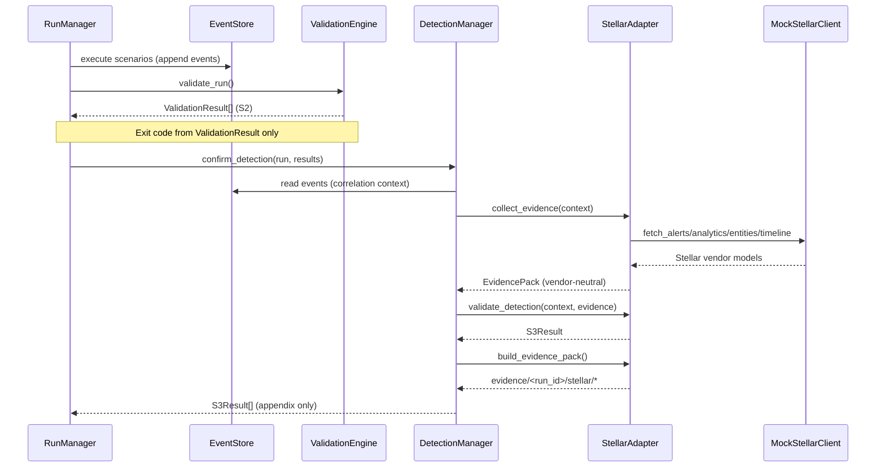
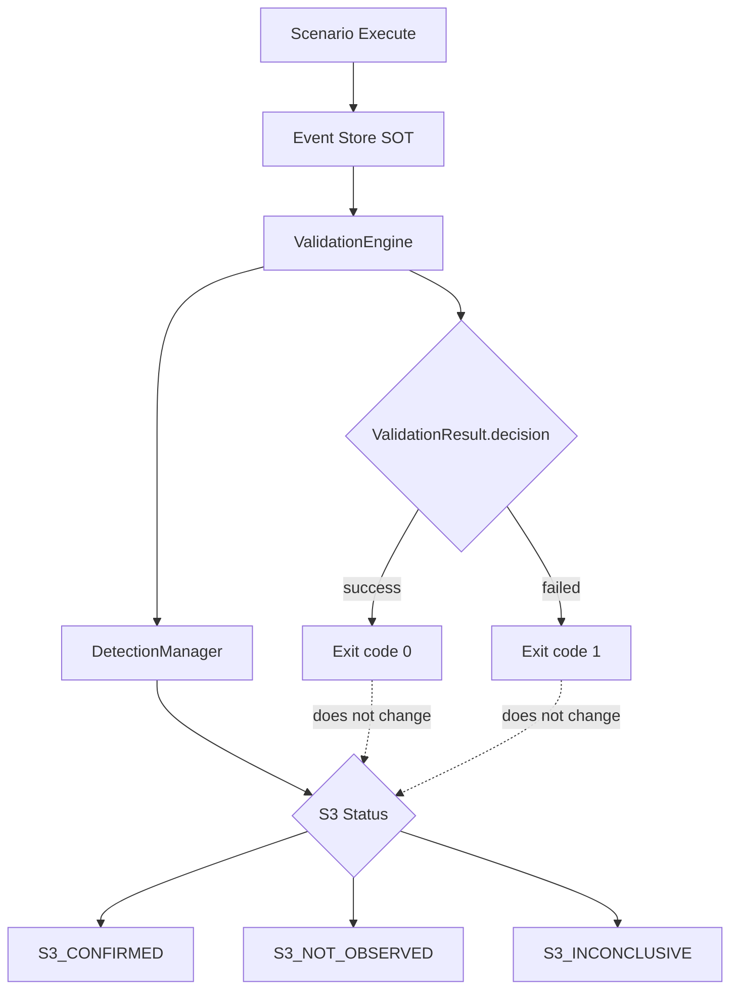

# Detection Adapter Layer — Architecture Design

**문서 버전:** 1.0.0  
**상태:** Phase 7 — Stellar MVP (Mock)  
**목적:** S3 (Detection Confirmed) 자동 검증을 위한 플러그형 Detection Adapter Layer

---

## 1. Executive Summary

DSP Phase 0–6.5는 **S2 (Traffic Validated)** 까지 완료되었습니다.  
본 Phase는 **S3 (Detection Confirmed)** 를 위한 **소비자(consumer) 계층**을 추가합니다.

| 원칙 | 설명 |
|------|------|
| Event Store = SOT | Adapter는 Event Store를 **읽기만** 함 |
| S2 ≠ S3 | Scenario 성공/exit code는 ValidationResult만 결정 |
| Adapter = Consumer | 탐지 증거와 S3 status만 생산 |
| Vendor-neutral | 증거 모델은 벤더 독립적; Stellar은 첫 provider |
| Mapping externalized | 시나리오↔탐지 매핑은 YAML, adapter 로직에 하드코딩 금지 |

---

## 2. Directory Tree

```
detection-scenario-platform/
├── dsp/
│   └── detection/                          # NEW — Detection Adapter Layer
│       ├── __init__.py
│       ├── base.py                         # DetectionAdapter ABC
│       ├── models.py                       # S3Status, Evidence*, S3Result
│       ├── correlation.py                  # run_id / time / IP / scenario scoring
│       ├── manager.py                      # DetectionManager orchestrator
│       └── providers/
│           ├── __init__.py
│           └── stellar/                    # Stellar MVP (mock)
│               ├── __init__.py
│               ├── stellar_adapter.py
│               ├── stellar_models.py         # MockStellarClient
│               ├── stellar_mapping.py        # YAML loader
│               └── scenario_mapping.yaml     # Externalized scenario mapping
├── tests/
│   └── detection/                          # NEW — unit tests
│       ├── test_models.py
│       ├── test_base.py
│       ├── test_correlation.py
│       ├── test_stellar_adapter.py
│       └── test_manager.py
└── DETECTION_ADAPTER_LAYER.md                # This document
```

### Run Artifact Output (per confirmation)

```
<run_dir>/
└── evidence/
    └── <run_id>/
        └── stellar/
            ├── alerts.json
            ├── analytics.json
            ├── entities.json
            ├── timeline.json
            ├── evidence.md
            └── s3_result.json
```

---

## 3. Class Definitions

### 3.1 Core Abstractions

```python
class DetectionAdapter(ABC):
    @property
    def vendor_id(self) -> str: ...

    def collect_evidence(self, context: CorrelationContext) -> EvidencePack: ...
    def validate_detection(self, context, evidence) -> S3Result: ...
    def build_evidence_pack(self, context, evidence, s3_result, output_dir) -> Path: ...
```

```python
class DetectionManager:
    def register_adapter(self, adapter: DetectionAdapter) -> None: ...
    def confirm_detection(self, run, validation_results, *, vendor_id, output_dir) -> list[S3Result]: ...
    def write_s3_results(self, base_dir, results) -> Path: ...
```

### 3.2 Data Models

| Model | Purpose |
|-------|---------|
| `S3Status` | `S3_CONFIRMED`, `S3_NOT_OBSERVED`, `S3_INCONCLUSIVE` |
| `CorrelationContext` | run_id, time window, IPs, scenario type, s2_decision |
| `AlertEvidence` | Vendor-neutral alert record |
| `AnalyticsEvidence` | Vendor-neutral analytics/incident record |
| `EntityEvidence` | Source/destination IP, host, endpoint |
| `TimelineEvidence` | Temporal detection events |
| `ArtifactEvidence` | FQDN, URL, payload artifacts |
| `EvidencePack` | Aggregated evidence container |
| `S3Result` | Final S3 outcome (never alters S2) |

### 3.3 Stellar Provider (MVP)

| Class | Role |
|-------|------|
| `StellarAdapter` | `DetectionAdapter` implementation |
| `MockStellarClient` | Stub alert/analytics/entity/timeline retrieval |
| `StellarMappingRegistry` | Loads `scenario_mapping.yaml` |
| `StellarClient` (Protocol) | Future real API interface |

---

## 4. Data Models

### 4.1 S3 Result (`s3_result.json`)

```json
{
  "run_id": "20260605_a3f2b1",
  "scenario": "dns_tunnel",
  "status": "S3_CONFIRMED",
  "vendor": "stellar",
  "evidence_count": 4,
  "timestamp": "2026-06-05T12:00:00Z",
  "reason": "correlation_score=0.85 meets confirmed threshold",
  "correlation_context": { "...": "..." }
}
```

### 4.2 S3 Status Semantics

| Status | Meaning | S2 Impact |
|--------|---------|-----------|
| `S3_CONFIRMED` | Correlated detection evidence found | None |
| `S3_NOT_OBSERVED` | Poll OK, no correlated evidence | None |
| `S3_INCONCLUSIVE` | S2 not success, or ambiguous score | None |

### 4.3 Correlation Weights

| Dimension | Weight | Source |
|-----------|--------|--------|
| run_id | 0.30 | Evidence `run_id` == context `run_id` |
| time_window | 0.25 | `observed_at` ∈ `[started_at-2m, ended_at+30m]` |
| source_ip | 0.15 | Entity/alert ref matches context |
| destination_ip | 0.15 | Entity/alert ref matches context |
| scenario_type | 0.15 | `scenario_id` or `detection_model_id` match |

**Thresholds:** confirmed ≥ 0.70, inconclusive ≥ 0.40

**Rule:** Alert name alone is insufficient — multi-dimensional correlation required.

---

## 5. Sequence Diagrams

### 5.1 Post-Validation S3 Flow



### 5.2 Adapter Plugin Registration (Future Vendors)

```mermaid
sequenceDiagram
    participant DM as DetectionManager
    participant ST as StellarAdapter
    participant SP as SplunkAdapter (future)

    DM->>ST: register_adapter(stellar)
    DM->>SP: register_adapter(splunk)
    DM->>DM: confirm_detection(vendor_id="stellar")
    Note over DM: Vendor selected at runtime; same CorrelationContext + EvidencePack contract
```

### 5.3 S2 vs S3 Independence



---

## 6. Scenario Mapping (Externalized)

File: `dsp/detection/providers/stellar/scenario_mapping.yaml`

| scenario_id | detection_model_id | alert_families (primary) |
|-------------|-------------------|--------------------------|
| `dns_tunnel` | `stellar.dns_tunnel` | DNS Tunnel, DNS Exfiltration |
| `dga` | `stellar.dga` | DGA, Domain Generation Algorithm |
| `http_followup` | `stellar.http_recon` | HTTP Reconnaissance |
| `ssh_failure` | `stellar.ssh_login_failure` | SSH Login Failure |
| `sql_injection` | `stellar.sql_injection` | SQL Injection |

Loader: `load_stellar_mapping()` in `stellar_mapping.py`

---

## 7. Test Plan

### 7.1 Unit Tests (implemented)

| Test File | Coverage |
|-----------|----------|
| `test_models.py` | S3Status, EvidencePack count, S3Result serialization |
| `test_base.py` | DetectionAdapter ABC, StellarAdapter interface contract |
| `test_correlation.py` | Time window, IP extraction, multi-dimensional scoring, S2 gate |
| `test_stellar_adapter.py` | YAML mapping, mock confirmed/not_observed, artifact output |
| `test_manager.py` | Orchestration, ValidationResult immutability, s3_result.json |

### 7.2 Integration Tests (future — Phase 8+)

| Test | Description |
|------|-------------|
| E2E post-run S3 | RunManager hook → DetectionManager after validation.json |
| Real Stellar API | Replace MockStellarClient with HTTP client behind `StellarClient` protocol |
| Multi-vendor | Register stellar + splunk; vendor_id CLI flag |
| Report appendix | `Report.detection_confirmation` populated from S3Result[] |

### 7.3 Regression Guard

- All 122 existing tests must pass unchanged
- Path Equality preserved (Execution = Validation = Reporting)
- No changes to Event Store schema, ValidationEngine, ReportingEngine primary table

---

## 8. Full Implementation Plan

### Phase 7 (Current — COMPLETE)

- [x] `dsp/detection/` package skeleton
- [x] Vendor-neutral evidence models + S3Status
- [x] `DetectionAdapter` interface
- [x] Correlation engine (run_id, time, IPs, scenario)
- [x] `DetectionManager` orchestrator
- [x] Stellar MVP: `MockStellarClient`, `scenario_mapping.yaml`
- [x] Evidence artifact writer (`evidence/<run_id>/stellar/`)
- [x] Unit tests (14+ new tests)

### Phase 8 — RunManager Integration (COMPLETE)

- [x] Optional `--confirm-detection` CLI flag (default off)
- [x] Optional `--detection-provider stellar` CLI flag (default: stellar)
- [x] Post-validation hook in `RunManager.run()` (after S2 report, before `events.jsonl` export)
- [x] Populate `Report.detection_confirmation` from `S3Result[]`
- [x] Report appendix section "Detection Confirmation"
- [x] Provider factory with clean failure for unsupported providers
- [x] Integration tests in `tests/runner/test_confirm_detection.py`

### Phase 9 — Real Stellar HTTP Client Scaffold (COMPLETE)

- [x] `StellarClient` ABC in `client_base.py` (`search_alerts/analytics/entities/timeline`)
- [x] `MockStellarClient` refactored to implement `StellarClient`
- [x] `StellarHttpClient` scaffold with injectable `HttpTransport`
- [x] Config from `DSP_STELLAR_*` environment variables (`stellar_config.py`)
- [x] Response normalization (`normalization.py`) — vendor-neutral evidence only in S3 decisions
- [x] Raw vendor JSON saved under `evidence/<run_id>/stellar/raw/` (sanitized, no secrets)
- [x] `--stellar-client mock|http` CLI flag (default: `mock`)
- [x] HTTP/auth/timeout/parse errors → `S3_INCONCLUSIVE`; empty poll → `S3_NOT_OBSERVED`
- [x] S2 exit code unchanged on HTTP failure
- [x] Unit tests with mocked HTTP transport only

### Phase 10 — Real Stellar API Tuning (planned)

- [ ] Tune query parameters against live Stellar lab appliance
- [ ] Advanced entity/time correlation filters
- [ ] Integration test against Stellar lab appliance (optional nightly)

### Phase 11 — Multi-Vendor (planned)

- [ ] `dsp/detection/providers/splunk/` adapter
- [ ] Provider registry via config (`detection.providers: [stellar, splunk]`)
- [ ] Per-vendor mapping YAML
- [ ] `--require-detection` exit code policy (separate from S2)

---

## 9. Non-Negotiable Compliance Checklist

| Rule | Status |
|------|--------|
| Existing scenarios unchanged | ✅ |
| Existing protocol libraries unchanged | ✅ |
| Existing validation logic unchanged | ✅ |
| Existing reporting logic unchanged | ✅ |
| Event Store schema unchanged | ✅ |
| Execution = Validation = Reporting preserved | ✅ |
| Adapter is consumer only | ✅ |
| Scenario success remains S2 only | ✅ |
| Adapter produces only S3 evidence + status | ✅ |
| No vendor lock-in (pluggable interface) | ✅ |
| No real Stellar API yet | ✅ |

---

## 10. Usage

### CLI (Phase 8 — recommended)

```bash
# Normal run — unchanged behavior
dsp run --scenarios dns_tunnel --dry-run

# Optional S3 confirmation (mock client — default)
dsp run --scenarios dns_tunnel --dry-run --confirm-detection --detection-provider stellar

# HTTP client mode (requires DSP_STELLAR_BASE_URL + DSP_STELLAR_API_TOKEN)
dsp run --scenarios dns_tunnel --dry-run --confirm-detection --stellar-client http
```

### Stellar HTTP environment variables

| Variable | Required (http mode) | Default |
|----------|---------------------|---------|
| `DSP_STELLAR_BASE_URL` | Yes | — |
| `DSP_STELLAR_API_TOKEN` | Yes | — |
| `DSP_STELLAR_VERIFY_TLS` | No | `true` |
| `DSP_STELLAR_TIMEOUT_SECONDS` | No | `30` |

Missing config or API errors produce `S3_INCONCLUSIVE` — never affect S2 exit code.
Secrets are redacted from evidence output (`***REDACTED***`).

### Programmatic (Phase 7 API still available)

```python
from pathlib import Path
from dsp.detection import DetectionManager
from dsp.detection.providers.stellar import StellarAdapter
from dsp.event_store import EventStore, Run
from dsp.validation import ValidationEngine

store = EventStore.open_existing(Path("~/.dsp/runs/<run_id>/events.db"))
run = Run.from_dict(json.loads(Path(".../run.json").read_text()))
results = ValidationEngine.load_validation_json(Path(".../validation.json"))

manager = DetectionManager(store, [StellarAdapter()])
s3_results = manager.confirm_detection(run, results, output_dir=Path("..."))
manager.write_s3_results(Path("..."), s3_results)
```

### RunManager integration (Phase 8)

```python
from dsp.runner import RunManager

manager = RunManager()
run, run_dir, exit_code = manager.run(
    scenario_ids=["dns_tunnel"],
    dry_run=True,
    confirm_detection=True,
    detection_provider="stellar",
)
# exit_code remains S2-based; S3 evidence in run_dir/evidence/<run_id>/stellar/
```

---

*End of Detection Adapter Layer Architecture — Phase 7*
