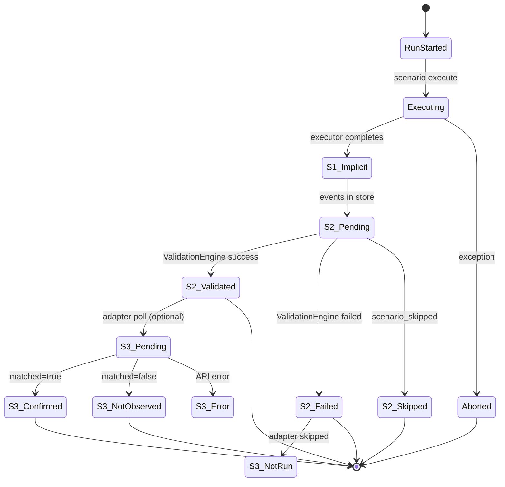

# Detection Scenario Platform — Detection Confidence Model

**문서 버전:** 1.0.0 (Phase 0.5 — **FROZEN**)  
**상태:** Canonical three-state model for traffic vs detection truth

---

## 1. Purpose

DSP는 **세 가지 독립적인 상태**로 PoC 결과를 표현한다.  
하나로 합치면 레거시 dual-path 버그가 재발한다.

| State | Question |
|-------|----------|
| **S1: Traffic Generated** | 트래픽/행위가 의도대로 실행되었는가? |
| **S2: Traffic Validated** | Event Store로 트래픽이 **증명**되었는가? |
| **S3: Detection Confirmed** | 보안 플랫폼에서 **탐지**가 관측되었는가? |

---

## 2. State Definitions (Frozen)

### S1 — Traffic Generated (Operational, non-SOT)

| Attribute | Value |
|-----------|-------|
| Meaning | Executor ran without immediate crash; operational belief |
| Source | **Not authoritative** — debug only |
| Used for validation? | **No** |
| Used for reporting decision? | **No** |

S1은 로그/stdout에 "sent=N"이 있어도 **S2 없으면 무효**.

### S2 — Traffic Validated (Authoritative for DSP)

| Attribute | Value |
|-----------|-------|
| Meaning | Event Store aggregate meets `validation_profile.success` |
| Source | Event Store → ValidationEngine → ValidationResult |
| Used for validation? | **Yes — sole traffic truth** |
| Used for reporting decision? | **Yes — primary table** |
| Used for Runner exit code? | **Yes (Phase 1–2)** |

### S3 — Detection Confirmed (Authoritative for vendor, optional)

| Attribute | Value |
|-----------|-------|
| Meaning | Detection adapter found matching alert/rule |
| Source | Vendor API / SIEM query → DetectionConfirmation |
| Used for validation? | **No** |
| Used for reporting decision? | **Separate appendix table** |
| Used for Runner exit code? | **No (Phase 1–3)** — optional flag Phase 4+ |

---

## 3. State Transition Diagram



---

## 4. Allowed Combinations (Frozen)

| S1 (debug) | S2 Traffic Validated | S3 Detection | Interpretation | Report primary |
|------------|---------------------|--------------|----------------|----------------|
| any | **success** | confirmed | Ideal PoC | S2 success + S3 yes |
| any | **success** | not_observed | Traffic OK, sensor silent | S2 success, S3 note |
| any | **success** | error | Traffic OK, API fail | S2 success, S3 error |
| any | **failed** | any | Traffic not proven | S2 failed |
| any | **skipped** | any | No targets / disabled | S2 skipped |
| stdout claims sent | **failed** | any | **Legacy bug class** — S2 wins | S2 failed |
| n/a | **code_failure** | any | Invariant broken | S2 code_failure |

**Forbidden reporting:**

- S1 alone → success
- S3 alone → success (without S2)
- S3 not_observed → downgrade S2 to failed

---

## 5. Reporting Rules (Frozen)

### 5.1 Primary Table — Traffic Validation (S2)

| Column | Source |
|--------|--------|
| scenario_id | ValidationResult |
| decision | ValidationResult.decision |
| reason | ValidationResult.reason |
| metrics | ValidationResult.metrics |

### 5.2 Secondary Table — Detection Confirmation (S3)

| Column | Source |
|--------|--------|
| scenario_id | DetectionConfirmation |
| detection_model_id | adapter |
| vendor | adapter |
| matched | bool |
| evidence | alert IDs, rule names |
| poll_error | if any |

### 5.3 Executive Summary

```
Traffic:  {success_count}/{total} validated (S2)
Detection: {confirmed_count}/{polled_count} confirmed (S3)  # if adapters enabled
```

### 5.4 Confidence Label (Optional display)

| S2 | S3 | Label |
|----|-----|-------|
| success | confirmed | **High confidence** |
| success | not_observed | **Traffic proven; detection unconfirmed** |
| success | error | **Traffic proven; detection poll failed** |
| failed | * | **Traffic not proven** |
| skipped | * | **Not executed** |

**금지:** single 0–100 synthetic score (legacy `detection_likelihood`).

---

## 6. Examples

### Example A — DNS Tunnel success + Stellar detection

| State | Value |
|-------|-------|
| S1 | executor log: 1500 queries |
| S2 | `decision=success`, `query_sent=1523` |
| S3 | `stellar.dns_tunnel matched=true` |

Report: Traffic ✅ | Detection ✅

### Example B — DNS Tunnel success, sensor silent

| State | Value |
|-------|-------|
| S1 | sent=1500 |
| S2 | `decision=success` |
| S3 | `matched=false` (poll OK) |

Report: Traffic ✅ | Detection ⚠ not observed  
Exit code: **0** (Phase 1–2 policy — S2 only)

### Example C — Legacy class bug

| State | Value |
|-------|-------|
| S1 | stdout `query_sent=200` |
| S2 | `decision=failed`, `event_count=0` |
| S3 | n/a |

Report: Traffic ❌ | Debug appendix shows stdout for forensics only

### Example D — Skipped scenario

| State | Value |
|-------|-------|
| S1 | n/a |
| S2 | `decision=skipped`, reason `no_dns_resolver` |
| S3 | not polled |

---

## 7. Phase Policy

| Phase | Exit code driven by | S3 in report |
|-------|---------------------|--------------|
| 1–2 | S2 only | omitted |
| 3 | S2 only | optional appendix |
| 4+ | configurable `--require-detection` | default shown |

---

## 8. Mapping to Entities

| State | Entity |
|-------|--------|
| S2 | ValidationResult ([EVENT_SCHEMA_FREEZE.md](./EVENT_SCHEMA_FREEZE.md)) |
| S3 | DetectionConfirmation |
| Events | Input to S2 only |

---

## 9. Related Documents

- [ARCHITECTURE_SPEC.md](./ARCHITECTURE_SPEC.md) §16
- [EVENT_SCHEMA_FREEZE.md](./EVENT_SCHEMA_FREEZE.md)
- [DETECTION_CATALOG.md](./DETECTION_CATALOG.md)
- [SKILL_SPEC.md](./SKILL_SPEC.md) §4.1
- [docs/adr/0004-no-stdout-validation.md](./docs/adr/0004-no-stdout-validation.md)
