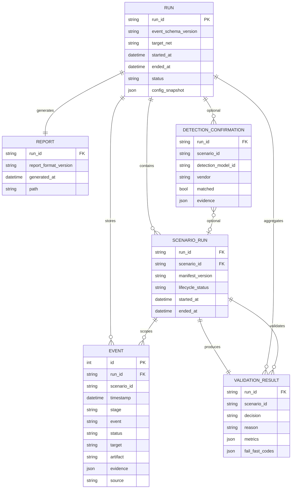

# Detection Scenario Platform — Event Schema Freeze

**문서 버전:** 1.0.0 (Phase 0.5 — **FROZEN**)  
**상태:** Canonical event contract — all implementation MUST conform  
**Supersedes:** EVENT_STORE_SPEC.md §3 (semantics frozen; storage details remain in EVENT_STORE_SPEC)

---

## 1. Freeze Declaration

| Artifact | Frozen ID | Change policy |
|----------|-----------|---------------|
| Entity model | `dsp_entity_model: 1.0.0` | ADR required for breaking change |
| Event row schema | `event_schema_version: 1.0.0` | Column add = minor; rename/drop = major |
| Status vocabulary | `event_status_vocab: 1.0.0` | new status = minor with doc |
| Validation result | `validation_result_schema: 1.0.0` | ADR for shape change |
| Report artifact | `report_format_version: 1.0.0` | ADR for section removal |

---

## 2. Entity Relationship Diagram



---

## 3. Entity Definitions

### 3.1 Run

Top-level execution unit. One `dsp run` invocation = one Run.

| Field | Type | Required | Description |
|-------|------|----------|-------------|
| `run_id` | string | yes | UUID or `{YYYYMMDD}_{slug}` — unique |
| `event_schema_version` | string | yes | `"1.0.0"` |
| `target_net` | string | yes | CIDR e.g. `10.10.10.0/24` |
| `started_at` | datetime UTC | yes | ISO-8601 |
| `ended_at` | datetime UTC | no | set on run completion |
| `status` | enum | yes | §3.1.1 |
| `dry_run` | bool | yes | default false |
| `requested_scenarios` | [string] | yes | CLI scenario list |
| `config_snapshot` | json | yes | resolved RunConfig |
| `dsp_version` | string | yes | platform version |

#### 3.1.1 Run.status (frozen)

`pending` | `running` | `completed` | `aborted` | `config_error`

**Storage:** `runs` table or `run.json` metadata beside `events.db` (implementation choice — fields frozen).

---

### 3.2 ScenarioRun

Per-scenario execution within a Run. Logical entity — may be materialized as events + derived row.

| Field | Type | Required | Description |
|-------|------|----------|-------------|
| `run_id` | string | yes | FK → Run |
| `scenario_id` | string | yes | manifest.id |
| `manifest_version` | string | yes | scenario semver at snapshot |
| `lifecycle_status` | enum | yes | §3.2.1 |
| `started_at` | datetime | no | from `scenario_started` event |
| `ended_at` | datetime | no | from `scenario_completed` / `scenario_aborted` |
| `skip_reason` | string | no | if skipped |

#### 3.2.1 ScenarioRun.lifecycle_status (frozen)

`registered` | `preparing` | `executing` | `executed` | `skipped` | `aborted` | `validating` | `validated`

Derived from lifecycle events — not set by executor return value.

---

### 3.3 Event

**Single Source of Truth** for traffic/behavior truth. Append-only.

| Field | Type | Required | Description |
|-------|------|----------|-------------|
| `id` | int64 | auto | SQLite AUTOINCREMENT |
| `event_schema_version` | string | yes | `"1.0.0"` per row |
| `run_id` | string | yes | indexed |
| `scenario_id` | string | yes | indexed (column name: `scenario`) |
| `timestamp` | datetime UTC | yes | indexed |
| `stage` | string | yes | `prepare` \| `executor` \| `runner` \| `main` |
| `event` | string | yes | verb_noun snake_case |
| `status` | string | yes | §3.3.1 — **never** `success`/`failed` |
| `target` | string | no | default `""` |
| `artifact` | string | no | FQDN, URL, user, etc. |
| `evidence` | json | yes | default `{}` |
| `source` | string | yes | §3.3.2 |
| `exit_code` | int | no | subprocess only |
| `tags` | [string] | no | default `[]` |

#### 3.3.1 Event.status vocabulary (frozen v1.0.0)

| Status | Use |
|--------|-----|
| `info` | lifecycle meta |
| `sent` | dispatched request/query |
| `response` | response received |
| `nxdomain` | DNS NXDOMAIN |
| `timeout` | timed out |
| `error` | protocol/socket error |
| `connection_refused` | TCP refused |
| `dns_failure` | HTTP client DNS fail |

**Forbidden as event.status:** `success`, `failed`, `partial`, `skipped` (those belong to ValidationResult / ScenarioRun only).

#### 3.3.2 Event.source (frozen)

`local` | `remote` | `dry_run` | `runner`

#### 3.3.3 Mandatory lifecycle events (per scenario run)

| event | status | stage | Writer |
|-------|--------|-------|--------|
| `scenario_started` | `info` | `executor` | Scenario or Runner |
| `scenario_completed` | `info` | `executor` | Scenario or Runner |
| `scenario_skipped` | `info` | `prepare` | Runner |
| `scenario_aborted` | `error` | `executor` | Runner |
| `scenario_prepared` | `info` | `prepare` | Scenario (optional) |

---

### 3.4 ValidationResult

Derived from Event Store — **not** append-only input. Cached per run.

| Field | Type | Required | Description |
|-------|------|----------|-------------|
| `run_id` | string | yes | |
| `scenario_id` | string | yes | |
| `decision` | enum | yes | §3.4.1 |
| `reason` | string | yes | machine-readable code |
| `metrics` | json | yes | from validation_profile |
| `fail_fast_codes` | [string] | no | invariant violations |
| `validated_at` | datetime | yes | |
| `validation_profile_version` | string | yes | from manifest |

#### 3.4.1 ValidationResult.decision (frozen)

`success` | `partial` | `failed` | `skipped` | `code_failure`

**Only Validation Engine may emit `decision`.**

---

### 3.5 Report

Human + machine readable output artifact.

| Field | Type | Required | Description |
|-------|------|----------|-------------|
| `run_id` | string | yes | |
| `report_format_version` | string | yes | `"1.0.0"` |
| `generated_at` | datetime | yes | |
| `path` | string | yes | e.g. `report.md` |
| `traffic_validation` | json | yes | ValidationResult[] embed |
| `detection_confirmation` | json | no | Phase 3+ |
| `event_samples` | json | yes | from Event Store |
| `run_metadata` | json | yes | Run entity snapshot |

Report MUST NOT contain metrics not traceable to Event Store or ValidationResult.

---

## 4. Relationships

```
Run 1 ── * Event                    (all events scoped by run_id)
Run 1 ── * ScenarioRun              (one per requested scenario)
ScenarioRun 1 ── * Event          (filter scenario_id)
ScenarioRun 1 ── 1 ValidationResult
Run 1 ── 1 Report                   (regenerable from Store + Results)
Run 1 ── * DetectionConfirmation    (optional, Phase 3+)
```

**Referential integrity:**

- Every Event MUST have valid `run_id`
- Every ValidationResult MUST reference scenario that was in `requested_scenarios` or was skipped with `scenario_skipped` event
- No Event with `scenario_id` not in registry at run start (except `runner` stage)

---

## 5. Event Lifecycle

```
[created]
   │ append() — immutable
   ▼
[stored] ── indexed by run_id, scenario_id, status, event
   │
   ├──► aggregate() → metrics
   ├──► sample() → report excerpts
   └──► export jsonl → audit copy (derivative)

[never updated]
[never deleted within retention window]
```

---

## 6. Run Lifecycle

```
pending
  │ Runner accepts config, creates run_id, opens Event Store
  ▼
running
  │ FOR each scenario: prepare → execute → (events)
  │ ValidationEngine.validate_run()
  │ ReportingEngine.generate()
  ▼
completed
  │ ended_at set, report written, exit code from ValidationResults

Alternative terminals:
  aborted     — unrecoverable runner error
  config_error — preflight safety / no active plugins
```

---

## 7. Retention Strategy (Frozen policy)

| Artifact | Retention | Location |
|----------|-----------|----------|
| `events.db` | default 90 days / last 500 runs | `~/.dsp/runs/<run_id>/` |
| `manifest.snapshot.json` | same as run | run directory |
| `validation.json` | same as run | run directory |
| `report.md` | same as run | run directory |
| `events.jsonl` export | optional on completion | run directory |
| `debug.log` | 30 days | run directory — **not SOT** |

| Command | Behavior |
|---------|----------|
| `dsp runs prune --keep N` | delete oldest run dirs (Phase 2) |
| `dsp export --run-id` | JSONL derivative anytime |

**Immutability:** After `Run.status = completed`, Event Store for that run is **read-only**.

---

## 8. SQLite Mapping (Frozen columns)

```sql
-- events table — column names frozen for v1.0.0
CREATE TABLE events (
    id          INTEGER PRIMARY KEY AUTOINCREMENT,
    event_schema_version TEXT NOT NULL DEFAULT '1.0.0',
    run_id      TEXT NOT NULL,
    timestamp   TEXT NOT NULL,
    scenario_id TEXT NOT NULL,
    stage       TEXT NOT NULL DEFAULT 'main',
    event       TEXT NOT NULL,
    status      TEXT NOT NULL,
    target      TEXT NOT NULL DEFAULT '',
    artifact    TEXT NOT NULL DEFAULT '',
    evidence    TEXT NOT NULL DEFAULT '{}',
    source      TEXT NOT NULL DEFAULT 'local',
    exit_code   INTEGER,
    tags        TEXT NOT NULL DEFAULT '[]'
);
```

Note: EVENT_STORE_SPEC used `scenario` — freeze canonical name **`scenario_id`** in DB column (implementation alias acceptable if documented).

---

## 9. JSON Examples

### Event (traffic)

```json
{
  "event_schema_version": "1.0.0",
  "run_id": "20260605_a1b2c3",
  "scenario_id": "dns_tunnel",
  "timestamp": "2026-06-05T14:00:00Z",
  "stage": "executor",
  "event": "query_sent",
  "status": "sent",
  "target": "10.10.10.20",
  "artifact": "idx-000001-abc.dns-tunnel.com",
  "evidence": {"qtype": "A", "seq": 1, "label_length": 45},
  "source": "local",
  "tags": []
}
```

### ValidationResult

```json
{
  "run_id": "20260605_a1b2c3",
  "scenario_id": "dns_tunnel",
  "decision": "success",
  "reason": "thresholds_met",
  "metrics": {"query_sent": 1523, "idx_pattern_count": 1400},
  "fail_fast_codes": [],
  "validated_at": "2026-06-05T14:03:00Z",
  "validation_profile_version": "1.0.0"
}
```

---

## 10. Compatibility

| Change | Version bump |
|--------|--------------|
| Add optional Event column | event_schema 1.1.0 |
| Rename Event column | event_schema 2.0.0 + migration |
| Add event.status value | vocab 1.1.0 |
| Add ValidationResult.decision value | validation_result 2.0.0 + ADR |

---

## 11. Related Documents

- [EVENT_STORE_SPEC.md](./EVENT_STORE_SPEC.md)
- [DETECTION_CONFIDENCE_MODEL.md](./DETECTION_CONFIDENCE_MODEL.md)
- [SCENARIO_MANIFEST_SPEC.md](./SCENARIO_MANIFEST_SPEC.md)
- [docs/adr/0002-event-store-as-sot.md](./docs/adr/0002-event-store-as-sot.md)
- [docs/adr/0005-sqlite-primary-storage.md](./docs/adr/0005-sqlite-primary-storage.md)
