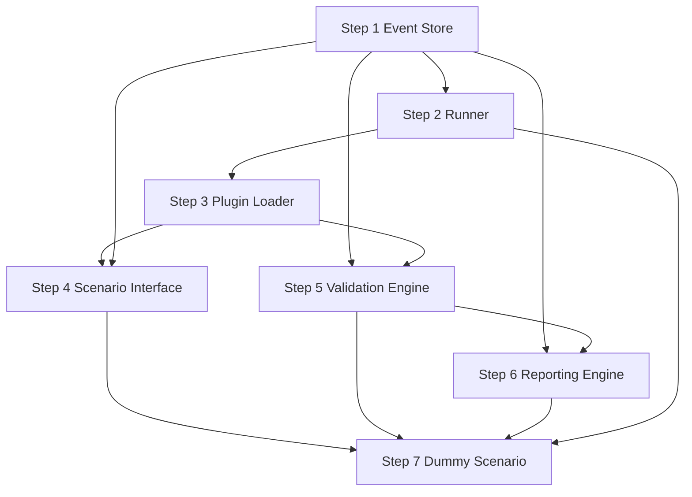

# Phase 1A — Implementation Execution Plan

**문서 버전:** 1.0.0 (Phase 0.6)  
**상태:** Documentation-only implementation sequence  
**범위:** Core Platform Skeleton + Dummy Scenario (no real traffic scenarios)

---

## 1. Purpose

본 문서는 Phase 1A 코딩 착수 시 **권장 구현 순서**, 의존성, 리스크, 단계별 acceptance를 정의한다.  
코드를 포함하지 않으며, 구현 에이전트·개발자의 작업 순서 가이드이다.

**Prerequisite documents:**

- [PHASE_1_ACCEPTANCE_CRITERIA.md](./PHASE_1_ACCEPTANCE_CRITERIA.md)
- [DEFINITION_OF_DONE.md](./DEFINITION_OF_DONE.md)
- All Phase 0.5 frozen contracts

---

## 2. Recommended Sequence Overview

```
Step 1 Event Store
    ↓
Step 2 Runner (skeleton)
    ↓
Step 3 Plugin Loader
    ↓
Step 4 Scenario Interface
    ↓
Step 5 Validation Engine
    ↓
Step 6 Reporting Engine
    ↓
Step 7 Dummy Scenario
    ↓
Integration + Path Equality tests
```

**Rationale:** Store-first — every downstream component depends on append/aggregate API. Runner skeleton early enables incremental wiring. Dummy Scenario last proves full stack.

---

## 3. Step-by-Step Plan

### Step 1 — Event Store

**Deliverables:**

- `dsp/event_store/models.py` — Event, Run dataclasses aligned with freeze
- `dsp/event_store/store.py` — SQLite implementation
- `tests/event_store/` — unit tests

**Dependencies:** None (foundation)

**Tasks:**

1. Implement frozen schema + indexes
2. Implement `open_run`, `append`, `close_run`
3. Implement `aggregate` with metric types: count, sum, distinct_artifact, ratio, json_extract
4. Implement `sample`, optional `export_jsonl`
5. Enforce forbidden status rejection
6. Enforce read-only after run complete

**Acceptance criteria:**

- [EVENT_STORE_ACCEPTANCE_SPEC.md](./EVENT_STORE_ACCEPTANCE_SPEC.md) ES-1–ES-8
- In-memory tests pass without network

**Success evidence:**

- pytest event_store suite green
- Sample aggregate query output for synthetic inserts

**Risks:** aggregate SQL complexity for ratio/json_extract — see Risk Register R-PE-02

---

### Step 2 — Runner

**Deliverables:**

- `dsp/runner/` — CLI entry, run lifecycle
- `pyproject.toml` — package metadata, `[project.scripts]` entry point
- Minimal Run metadata persistence (`run.json`)

**Dependencies:** Step 1 (Event Store open/close)

**Tasks:**

1. Parse CLI: `--scenarios`, `--dry-run`, `--target-net` (stub target OK for 1A)
2. Create run_id, open store
3. Lifecycle: pending → running → completed | aborted | config_error
4. Placeholder hooks for plugin execution (filled Step 3–7)
5. Wire validate + report calls after scenario loop (Steps 5–6)
6. Exit code from ValidationResult aggregate

**Acceptance criteria:**

- Run creates isolated directory under default path
- Run metadata fields per EVENT_SCHEMA_FREEZE §3.1

**Success evidence:**

- `dsp run --help` works
- Empty run aborts gracefully with config_error if no plugins

**Risks:** Open questions Q4 (run directory), Q6 (pyproject backend) — resolve at step start

---

### Step 3 — Plugin Loader

**Deliverables:**

- `dsp/plugins/loader.py`, `registry.py`, `validator.py`, `models.py`
- `tests/plugins/`

**Dependencies:** Step 2 (Runner invokes discovery on start)

**Tasks:**

1. Scan `scenarios/` directory
2. Parse and validate manifest v1.0.0
3. Implement PluginStatus state machine
4. Import `scenario.py`, verify `scenario_id()` match
5. Register ACTIVE plugins; handle DISABLED, REJECTED, CONFLICT, UNAVAILABLE
6. Expose `list-scenarios` / `plugins list` CLI

**Acceptance criteria:**

- PLUGIN_DISCOVERY_SPEC lifecycle honored
- Invalid manifest → REJECTED

**Success evidence:**

- Test: duplicate id → CONFLICT
- Test: enabled:false → DISABLED

**Risks:** Manifest validation scope creep — stick to M1–M10 only for 1A

---

### Step 4 — Scenario Interface

**Deliverables:**

- `dsp/engine/scenario_engine.py` — base Scenario, RunContext, exceptions
- `dsp/engine/target_engine.py` — minimal TargetSet stub for dummy

**Dependencies:** Steps 1–3

**Tasks:**

1. Implement frozen RunContext surface (read-mostly fields)
2. Implement Scenario ABC / Protocol binding
3. Implement `ScenarioSkipError`, `SafetyViolationError`
4. Runner orchestration: prepare → execute → summarize sequence
5. Timeout and cancellation flags on RunContext
6. Emit lifecycle events on skip/abort per interface freeze

**Acceptance criteria:**

- SCENARIO_INTERFACE_FREEZE §4–§7 behavior
- execute() return None enforced (type checker / test)

**Success evidence:**

- Unit test: skip path writes scenario_skipped, execute not called
- Unit test: exception → scenario_aborted

**Risks:** Over-building TargetProvider — defer full probing to Phase 1B

---

### Step 5 — Validation Engine

**Deliverables:**

- `dsp/validation/engine.py`
- `tests/validation/` including Path Equality seeds

**Dependencies:** Steps 1, 3 (manifest validation_profile)

**Tasks:**

1. Load validation_profile from registry manifest
2. Call `store.aggregate()` for each metric definition
3. Apply success / partial thresholds
4. Evaluate fail_fast invariants (minimum: SOT_EMPTY_AFTER_EXECUTE, COUNTER_IMPOSSIBLE)
5. Emit ValidationResult; write validation.json
6. **No** per-scenario if/else

**Acceptance criteria:**

- Validation reads Store only
- decision enum frozen

**Success evidence:**

- Synthetic events → expected decision
- stdout-only fixture test → code_failure

**Risks:** Validation/report divergence — mitigated by shared aggregate only (R-VR-01)

---

### Step 6 — Reporting Engine

**Deliverables:**

- `dsp/reporting/engine.py`
- Report templates Markdown v1.0.0

**Dependencies:** Steps 1, 5

**Tasks:**

1. Build run metadata section from Run entity
2. Primary table from ValidationResult[] only
3. Event samples via store.sample()
4. Optional ScenarioSummary enrichment section (non-decision)
5. Write report.md + embedded JSON section
6. Regenerate command or API

**Acceptance criteria:**

- REPORT compliance checklist R-1–R-8

**Success evidence:**

- Report regeneration test passes
- Metric trace table fillable (PATH_EQUALITY_VERIFICATION_SPEC §7.1)

**Risks:** Template scope creep — minimal table for 1A

---

### Step 7 — Dummy Scenario

**Deliverables:**

- `scenarios/dummy/manifest.yaml` — valid v1.0.0
- `scenarios/dummy/scenario.py` — no network I/O
- `tests/scenarios/test_dummy_*.py`

**Dependencies:** Steps 1–6 complete

**Tasks:**

1. manifest: category `endpoint` or `network`, minimal protocols/targets
2. validation_profile: count synthetic_action events with status sent
3. prepare: emit scenario_prepared (optional)
4. execute: dry-run or local synthetic events only
5. summarize: query store for counts
6. E2E: `dsp run --scenarios dummy --dry-run`

**Acceptance criteria:**

- [PHASE_1_ACCEPTANCE_CRITERIA.md](./PHASE_1_ACCEPTANCE_CRITERIA.md) EC-1–EC-8

**Success evidence:**

- Full artifact set in run directory
- Path Equality pytest green
- ARCHITECTURE_COMPLIANCE_CHECKLIST signed

**Risks:** Dummy too trivial — must still exercise full manifest validation_profile path

---

## 4. Integration Milestone (Post Step 7)

| Milestone | Criteria |
|-----------|----------|
| M1 — Store standalone | Step 1 tests pass |
| M2 — Runner + empty registry | Step 2–3 |
| M3 — Validate without scenario | Engine tests with manual events |
| M4 — Full E2E dummy | Steps 1–7 |
| M5 — Phase 1A gate | All acceptance + compliance docs |

**Final integration tests:**

1. E2E dry-run
2. Path Equality suite
3. Repository boundary (git diff scope)
4. Report regeneration
5. Second plugin folder (copy dummy → dummy2) without core validation edit

---

## 5. Dependency Graph



---

## 6. Risks (Cross-Reference)

See [IMPLEMENTATION_RISK_REGISTER.md](./IMPLEMENTATION_RISK_REGISTER.md).

| Step | Primary risks |
|------|---------------|
| 1 | Schema drift, aggregate bugs |
| 2 | Run directory, exit code logic |
| 3 | Manifest validator incompleteness |
| 4 | TargetProvider scope creep |
| 5 | Hardcoded scenario branches |
| 6 | Report metrics not traced |
| 7 | Scope drift (real scenarios) |

---

## 7. Out of Sequence Work (Forbidden)

| Forbidden early work | Why |
|---------------------|-----|
| dns_tunnel before Step 7 complete | Scope + protocol dependency |
| Detection adapter | Phase 3 |
| Protocol library production code | Phase 1B |
| deployment hooks | Boundary violation |
| Validation before Event Store aggregate | Path Equality broken |
| Report before ValidationResult | Wrong dependency |

---

## 8. Open Questions Resolution Schedule

Resolve at indicated step start (from Phase 0.5 Q1–Q7):

| ID | Question | Resolve at |
|----|----------|------------|
| Q1 | Python 3.11 | Step 2 (pyproject.toml) |
| Q2 | ratio metric algo | Step 5 |
| Q3 | Package name `dsp` | Step 2 |
| Q4 | Run directory default | Step 2 |
| Q5 | Per-run events.db | Step 1 |
| Q6 | hatchling vs setuptools | Step 2 |
| Q7 | Cursor Skill install | Post M4 (first commit policy) |

Document decisions in README Phase 1A section or short ADR if deviating from recommendation.

---

## 9. Phase 1A Completion Gate

Implementation may declare Phase 1A complete when:

1. All seven steps delivered
2. [PHASE_1_ACCEPTANCE_CRITERIA.md](./PHASE_1_ACCEPTANCE_CRITERIA.md) exit criteria satisfied
3. [PHASE_0_6_IMPLEMENTATION_READINESS_REVIEW.md](./PHASE_0_6_IMPLEMENTATION_READINESS_REVIEW.md) Go recommendation fulfilled
4. Explicit authorization to begin Phase 1B (separate scope)

---

## 10. Related Documents

- [PHASE_1_ACCEPTANCE_CRITERIA.md](./PHASE_1_ACCEPTANCE_CRITERIA.md)
- [IMPLEMENTATION_RISK_REGISTER.md](./IMPLEMENTATION_RISK_REGISTER.md)
- [PATH_EQUALITY_VERIFICATION_SPEC.md](./PATH_EQUALITY_VERIFICATION_SPEC.md)
- [EVENT_STORE_ACCEPTANCE_SPEC.md](./EVENT_STORE_ACCEPTANCE_SPEC.md)
- [PHASE_0_5_ARCHITECTURE_FREEZE_REVIEW.md](./PHASE_0_5_ARCHITECTURE_FREEZE_REVIEW.md) §8
