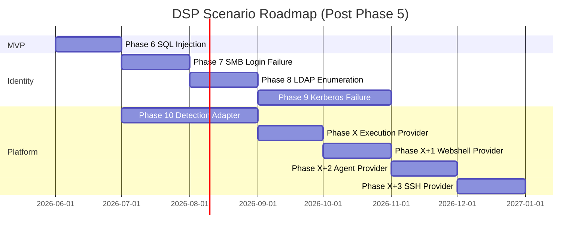

# Phase Roadmap — Phase 5.5 Update

**문서 버전:** 1.1.0  
**상태:** Documentation only  
**기준:** Phase 5 (SSH Login Failure) 완료 후 Detection Coverage Review

---

## 1. Completed Phases

| Phase | Deliverable | Scenarios | S2 Status |
|-------|-------------|-----------|-----------|
| Phase 1A | Platform skeleton, Event Store, dummy | `dummy` | ✅ |
| Phase 1B | DNS protocol library | `dns_dummy`, `dns_transport_dummy` | ✅ |
| Phase 2 | DNS Tunnel | `dns_tunnel` | ✅ |
| Phase 3 | DGA | `dga` | ✅ |
| Phase 4 | HTTP Follow-up | `http_followup` | ✅ |
| Phase 5 | SSH Login Failure | `ssh_failure` | ✅ |
| Phase 5.5 | Detection Coverage Review (this doc set) | — | — |

**누적 구현:** 4 production traffic scenarios + 3 validation/dummy scenarios.

---

## 2. Coverage at a Glance

```
Implemented:  DNS Tunnel | DGA | HTTP Follow-up | SSH Failure
MVP Remaining: SQL Injection (1)
Future:        SMB | LDAP | Kerberos | Port Sweep | Internal Recon | DNS TXT | ...
Infrastructure: Detection Adapter Layer (S3)
Infrastructure: Execution Provider Layer (Mode B — remote traffic)
```

| Metric | Value |
|--------|-------|
| Catalog MVP scenarios | 5 |
| MVP implemented | 4 (80%) |
| Stellar FULL coverage models | 2–3 (DNS Tunnel, DGA, SSH partial) |
| S3 vendor-confirmed | 0 |
| pytest (DSP) | 107 passed |

---

## 3. Proposed Phase Sequence

### Phase 6 — SQL Injection

| Item | Detail |
|------|--------|
| **Scenario ID** | `sql_injection` |
| **Category** | web |
| **Protocol** | `dsp/protocols/http/` 확장 (payloads.py) |
| **Target Detection** | Stellar SQL injection · Splunk SQLi · WAF signature |
| **Traffic** | GET `?id=1' OR '1'='1`, `UNION SELECT` 등 고정 payload |
| **Validation** | `injection_request_sent_count >= 1` |
| **Safety** | `forbidden_actions: [data_exfiltration, destructive_sql]` |
| **Rationale** | MVP 마지막 1건; HTTP Follow-up 인프라 100% 재사용 |
| **Exit criteria** | E2E + path equality + 107+ tests pass |

---

### Phase 7 — SMB Login Failure

| Item | Detail |
|------|--------|
| **Scenario ID** | `smb_login_failure` |
| **Category** | auth |
| **Protocol** | `dsp/protocols/smb/` (신규) |
| **Target Detection** | Stellar SMB bad auth · Splunk SMB brute force |
| **Traffic** | TCP/445; safe auth failure burst; dummy username |
| **Validation** | `smb_auth_attempt_count`, `smb_auth_failed_count` |
| **Dependencies** | Windows/SMB lab target, `windows_host` role |
| **Rationale** | Identity 축 2번째 프로토콜; SSH PARTIAL 보완 |
| **Parallel option** | `port_sweep` atomic 시나리오 (Phase 7b) |

---

### Phase 8 — LDAP Enumeration

| Item | Detail |
|------|--------|
| **Scenario ID** | `ldap_enumeration` |
| **Category** | identity |
| **Protocol** | `dsp/protocols/ldap/` (신규) |
| **Target Detection** | Stellar AD Discovery · Elastic LDAP enum |
| **Traffic** | TCP/389·636; anonymous/bind enumeration; read-only |
| **Validation** | `ldap_query_sent_count >= 1` |
| **Dependencies** | Domain Controller, AD lab |
| **Rationale** | Windows Identity 심화; SMB 이후 자연 확장 |

**Optional Phase 8b:** `port_sweep` — Internal Recon 선행 조건  
**Optional Phase 8c:** `dns_txt_exfil` — DNS family 확장

---

### Phase 9 — Kerberos Failure

| Item | Detail |
|------|--------|
| **Scenario ID** | `kerberos_auth_failure` |
| **Category** | identity |
| **Protocol** | `dsp/protocols/kerberos/` (신규) |
| **Target Detection** | Defender Kerberos pre-auth failure · QRadar Kerberos anomaly |
| **Traffic** | UDP/88; invalid principal; pre-auth failure burst |
| **Validation** | `kerberos_preauth_failure_count >= 1` |
| **Dependencies** | DC, realm, strict volume caps |
| **Rationale** | Enterprise Identity; 고난이도·고가치 |
| **Risk** | DC 부하 — safety.max_events·rate limit 강화 필수 |

---

### Phase 10 — Detection Adapter Layer

| Item | Detail |
|------|--------|
| **Component** | `dsp/adapters/` (신규 패키지) |
| **Adapters** | `stellar/`, `splunk/`, (optional) `defender/`, `sentinelone/` |
| **Purpose** | S3 Detection Confirmed — Catalog mapping → API poll |
| **Interface** | `DetectionConfirmation` per DETECTION_CONFIDENCE_MODEL.md |
| **CLI** | `dsp run --require-detection` (optional, default off) |
| **Report** | Secondary table — Detection Confirmation appendix |
| **Rationale** | S2만으로는 "탐지 검증 플랫폼" 주장 불완전; Catalog `validated` 전환 조건 |
| **Prerequisite** | 최소 4 시나리오 + live Stellar lab 연동 |

---

## 4. Execution Provider Roadmap (Phase Numbers Unassigned)

XDR/NDR PoC 원래 요구사항인 **Remote Execution (Mode B)** 를 공식 지원하기 위한 플랫폼 로드맵.  
Phase 번호는 기존 시나리오·Detection Adapter 일정과 조율 후 할당한다.

| Phase | Deliverable | Scope |
|-------|-------------|-------|
| **Phase X** | Execution Provider Framework | `ExecutionProvider` interface, registry, `LocalExecutionProvider` formalization, event sync bridge spec, path equality tests |
| **Phase X+1** | Webshell Execution Provider | HTTP webshell transport, legacy bootstrap pattern 격리, lab opt-in safety |
| **Phase X+2** | Agent Execution Provider | Caldera/Sliver-compatible agent dispatch, capability matrix |
| **Phase X+3** | SSH Execution Provider | SSH remote exec transport, staging policy |

### Phase X — Execution Provider Framework

| Item | Detail |
|------|--------|
| **Component** | `dsp/execution/` (신규 패키지, 개념) |
| **Interface** | [EXECUTION_PROVIDER_SPEC.md](./EXECUTION_PROVIDER_SPEC.md) |
| **ADR** | [0006 — Execution Provider Architecture](./docs/adr/0006-execution-provider-architecture.md) |
| **Default** | `LocalExecutionProvider` — Mode A backward compatible |
| **Invariant** | Event Store SOT, Validation unchanged, scenarios execution-agnostic |
| **Exit criteria** | Path equality tests; existing scenarios pass with local provider; no scenario code changes |

### Phase X+1 — Webshell Execution Provider

| Item | Detail |
|------|--------|
| **Provider ID** | `webshell` |
| **Mode** | B — traffic from remote victim host |
| **Legacy alignment** | `stellar_poc.sh` webshell bootstrap → provider only |
| **Constraints** | UDP/53 may require relay; explicit `--allow-webshell` |
| **Exit criteria** | ≥1 scenario E2E via webshell; events synced; same validate() as local |

### Phase X+2 — Agent Execution Provider

| Item | Detail |
|------|--------|
| **Provider ID** | `agent` |
| **Mode** | B — traffic from agent endpoint |
| **Integration refs** | xdr-lab Caldera/Sliver docs (design only) |
| **Exit criteria** | Agent task dispatch + event sync; capability matrix documented |

### Phase X+3 — SSH Execution Provider

| Item | Detail |
|------|--------|
| **Provider ID** | `ssh` |
| **Mode** | B — traffic from SSH-accessible host |
| **Distinction** | Transport SSH ≠ `ssh_failure` scenario target |
| **Exit criteria** | Remote execute + event sync; safety allowlist enforced |

**Architecture docs (complete, no implementation):**

- [docs/architecture/EXECUTION_MODEL_SPEC.md](./docs/architecture/EXECUTION_MODEL_SPEC.md)
- [docs/architecture/EXECUTION_PROVIDER_DECISION_RECORD.md](./docs/architecture/EXECUTION_PROVIDER_DECISION_RECORD.md)

---

## 5. Roadmap Timeline (Suggested)



> Phase X~X+3 번호 미할당. Execution Provider는 Detection Adapter(Phase 10) 이후 또는 병렬 착수 가능 — lab PoC 우선순위에 따라 조율.

---

## 6. Post-Phase 10 Candidates (Phase 11+)

| Phase | Scenario | Priority | Notes |
|-------|----------|----------|-------|
| 11 | `port_sweep` | HIGH | Recon atomic; Internal Recon 선행 |
| 12 | `dns_txt_exfil` | MEDIUM | DNS tunnel 상보 |
| 13 | `internal_recon` | MEDIUM | Composite — sweep + HTTP + optional |
| 14 | `rdp_login_failure` | MEDIUM | Identity Windows |
| 15 | `webshell_callback` | LOW | High complexity; safety review |
| 16 | `eicar_file_create` | LOW | EDR axis (별도) |

---

## 7. Success Criteria per Phase

모든 시나리오 Phase는 동일 Acceptance Pattern:

1. `scenarios/<id>/` — manifest + scenario + executor
2. `dsp/protocols/<proto>/` — events + validation + reporting
3. Event Store SOT only — no stdout validation
4. Path Equality tests
5. E2E dry_run + live (mocked transport)
6. 기존 전체 pytest pass
7. Catalog + Coverage docs 업데이트 (문서 Phase)

**Phase 10 추가 기준:**

1. Stellar adapter: 최소 `dns_tunnel`, `dga` S3 confirmed in lab
2. Splunk adapter: search template per detection_model_id
3. Report secondary table populated
4. `--require-detection` does not downgrade S2

**Phase X (Execution Provider Framework) 추가 기준:**

1. `ExecutionProvider` interface + registry documented and tested (local only)
2. `LocalExecutionProvider` formalized — zero behavior change vs Phase 1–5
3. Path equality: remote provider mock → sync → same `validate()`
4. Zero scenario modifications for framework landing

**Phase X+1~X+3 추가 기준:**

1. Provider-specific E2E with event sync to local Event Store
2. Same manifest validation thresholds as Mode A
3. Safety envelope (allowlist, opt-in) enforced
4. No stdout validation (ADR 0004)

---

## 8. 3-Year Horizon (from Catalog)

| Goal | Target | Current |
|------|--------|---------|
| Catalog scenarios | 30–50 | ~20 catalogued |
| Implemented | 15+ | 4 production |
| S3 validated (Stellar) | 10–15 | 0 |
| Vendor adapters | 3+ | 0 |
| Execution providers | 4 (local + 3 remote) | 1 implicit (local) |

---

## 9. Decision Log

| Decision | Rationale |
|----------|-----------|
| SQL Injection before SMB | MVP 완성; lower risk; HTTP reuse |
| Adapter at Phase 10 not Phase 6 | 시나리오 볼륨 확보 후 S3 ROI; Adapter는 횡단 관심사 |
| Kerberos after LDAP | DC 의존·복잡도 순서 |
| Internal Recon deferred | Composite scope; atomic recon 먼저 |
| Execution Provider after framework doc | Mode B architecture frozen before implementation; Phase X number TBD |
| Scenarios stay execution-agnostic | One dns_tunnel for all providers — ADR 0006 |

---

## 10. Related Documents

- [DETECTION_COVERAGE_REVIEW.md](./DETECTION_COVERAGE_REVIEW.md)
- [EXECUTION_PROVIDER_SPEC.md](./EXECUTION_PROVIDER_SPEC.md)
- [docs/architecture/EXECUTION_MODEL_SPEC.md](./docs/architecture/EXECUTION_MODEL_SPEC.md)
- [docs/adr/0006-execution-provider-architecture.md](./docs/adr/0006-execution-provider-architecture.md)
- [SCENARIO_TO_MODEL_MATRIX.md](./SCENARIO_TO_MODEL_MATRIX.md)
- [DETECTION_GAP_ANALYSIS.md](./DETECTION_GAP_ANALYSIS.md)
- [DETECTION_CATALOG.md](./DETECTION_CATALOG.md) §7 Priority Roadmap
- [DETECTION_CONFIDENCE_MODEL.md](./DETECTION_CONFIDENCE_MODEL.md)
